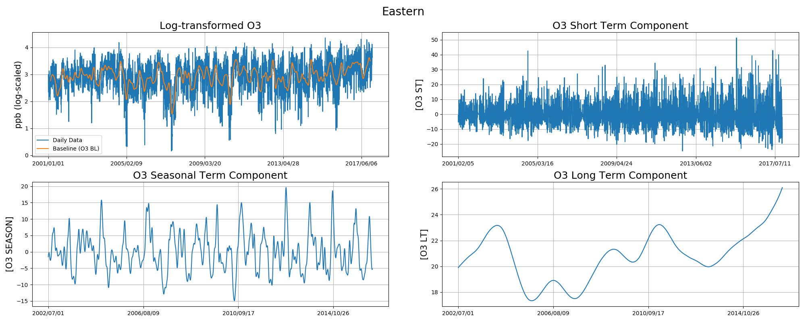

# Using KZ filter to detrend O3

## Overview
* KZ filter

* Regression

* Future Data

* Spark

## KZ filter

### detrend.py

detrend O3 data from 'Eastern', 'Kwai Chung', 'Tung Chung', 'YL', 'Kwun Tong', 'Macau', 'Sha Tin', 'ShamShuiPo', 'Tap Mun', 'Tsuen Wan'

saved into detrend folder

This process can be visualized as the following figure:

Raw data provided from Supplement folder

## Regression

## Future Data

## Spark

## References

